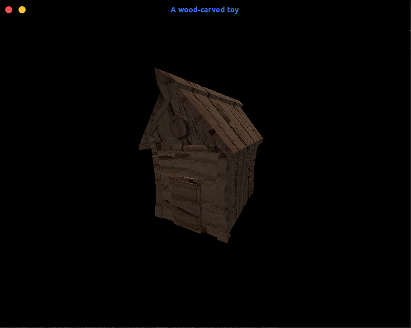

# 3D Wood-carved Toy House
Discovering computer graphics...<br>
A 3d house made with Blender and Pygame
<p align="center">
    
</p>

## Run
Install required packages
```
pip3 install requirements.txt
```
Run the main script. The default path to .obj file is files/wood_cabin.obj
```
python3 main.py <PATH TO OBJ FILE>
```
Custom models can shown by just uploading the .obj and .mtl files into /files.
## User interactions
> Press and hold <b>left mouse button</b> to <b>rotate</b> the house<br>
> Press and hold <b>right mouse button</b> to <b>move</b> the house around the screen